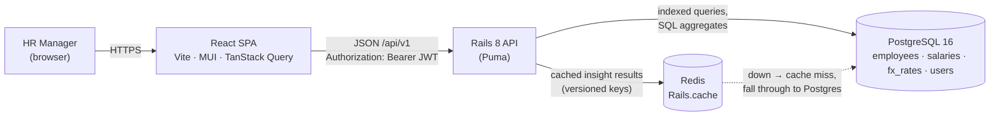
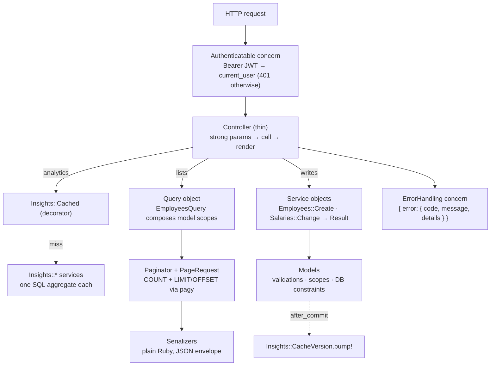
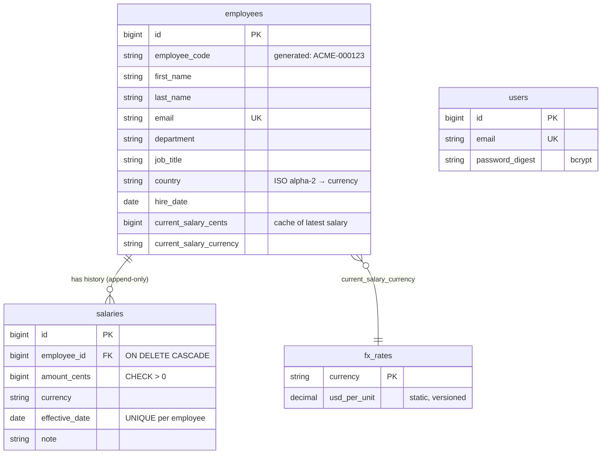

# Architecture

## System overview



- **Stateless API:** a JWT carries the identity, so any Puma worker or instance can serve any request.
- **Postgres is the source of truth.** Redis only holds derived aggregates and can be flushed at any time.
- In development, Vite proxies `/api` to Rails, so the SPA and API share an origin. In production CORS
  is restricted to `CORS_ORIGINS`.

## Request lifecycle (backend)



| Layer | Location | Responsibility |
|---|---|---|
| Controllers | `app/controllers/api/v1` | HTTP only: params, status codes, rendering |
| Concerns | `app/controllers/concerns` | `Authenticatable`, `Paginatable`, `ErrorHandling` (shared by every controller) |
| Query objects | `app/queries` | Read-side composition of scopes, whitelisted sorting |
| Services | `app/services` | Business operations returning `Result`; insight aggregates; JWT; FX config |
| Models | `app/models` | Persistence, validations, scopes; `Monetizable`, `InvalidatesInsightsCache` concerns |
| Value objects | `app/models/{money,country,department,job_title}.rb` | Immutable `Data` types and config-backed registries |
| Validators | `app/validators` | Rules shared across models (currency ↔ country, not-in-future) |
| Seeds | `lib/seeds` | Deterministic generator (weighted sampling, pay bands, names) |

## Data model



## Frontend structure

```
src/
  app/          App routes, theme (light + dark), QueryClient
  lib/          http (single axios instance + interceptors), formatters, API error helpers
  types/        API contract types (shared by every feature)
  hooks/        useUrlState (filters in the URL), useDebouncedValue, useChartColor
  components/   AppLayout, PageHeader, FilterBar, ServerDataGrid, QueryStateBoundary,
                StatTile, MoneyText, ConfirmDialog …   (generic, reused across features)
  features/
    auth/       AuthProvider (context), RequireAuth (route guard), LoginPage, api
    meta/       reference data (countries, departments) cached for the session
    employees/  directory, detail + salary history, create/edit, change-salary dialog
    insights/   KPI tiles, payroll-by-country / -department charts, job-title stats
    outliers/   threshold slider, peer-deviation grid
```

- **Data flow:** component → feature hook (TanStack Query) → feature `api.ts` → shared `http` client.
  Components never import axios.
- **Server state lives in TanStack Query.** Query keys are hierarchical, so a salary change invalidates
  `['employees']` and `['insights']` in one call.
- **URL state:** directory, insights and outliers filters and pagination live in the query string, so
  views are shareable and survive reloads.
- **Code splitting:** the chart-heavy Insights and Outliers pages are lazy-loaded.
